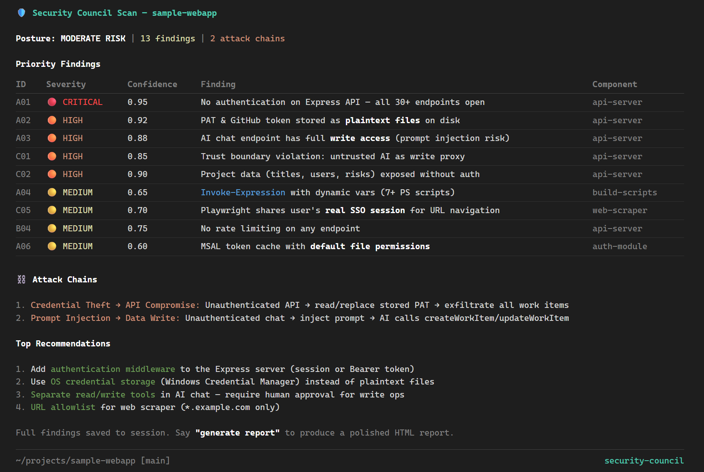

# Copilot CLI Knowledge Agents

13 specialized AI agents for GitHub Copilot CLI. Copy the `.github/agents/` folder into your repo or working directory, then start Copilot from that directory.

> **Attribution**: 12 agents ported from [Anthropic's knowledge-work-plugins](https://github.com/anthropics/knowledge-work-plugins). The `security` agent is an original extension with multi-persona scanning and adversarial debate.

## Quick Start

```powershell
# Clone this fork
git clone https://github.com/beeisabelm/copilot-cli-knowledge-agents
cd copilot-cli-knowledge-agents

# Or just copy agents into an existing repo
# Copy .github/agents/*.agent.md to your-repo/.github/agents/
```

Then start Copilot CLI:

```powershell
copilot
```

## Available Agents

Select an agent with `/agent`:

```
Custom Agents:
  1. Default (current)
  2. customer-support
  3. data
  4. design
  5. engineering
  6. finance
  7. legal
  8. marketing
  9. operations
  10. product-management
  11. productivity
  12. sales
  13. human-resources
  14. security
```

| Agent | Purpose |
|-------|---------|
| `customer-support` | Ticket triage, responses, escalation, knowledge base |
| `data` | SQL queries, data exploration, visualizations, dashboards |
| `design` | Design critique, accessibility, UX writing, dev handoff |
| `engineering` | Code review, architecture decisions, incident response, standups |
| `finance` | Journal entries, reconciliation, variance analysis, SOX |
| `human-resources` | Recruiting, onboarding, performance reviews, comp analysis |
| `legal` | Contract review, NDA triage, compliance checks |
| `marketing` | Content creation, campaigns, SEO, competitive analysis |
| `operations` | Process docs, runbooks, vendor management, capacity planning |
| `productivity` | Task management, daily planning, memory management |
| `product-management` | Feature specs, roadmaps, stakeholder updates, research synthesis |
| `sales` | Outreach, call prep, pipeline review, account research |
| `security` ⚡ | Multi-persona security scan (Attacker/Auditor/Architect) with adversarial debate |

## Usage Examples

Ask the agent what it can do:

```
/agent product-management
```

Then:

```
write-spec a tiered pricing model for annual SaaS subscriptions with volume discounts
```

Or jump straight to a command:

```
competitive-brief on Notion vs Confluence for team documentation
```

```
stakeholder-update for executives on Q2 product launch progress
```

---

## Security Agent (Full Extension) - NEW!!

The `security` agent differs from the other 12 — it's an original **extension-based agent** with runtime tools, in-memory state tracking, and adversarial debate.



### How It Works

Four AI models review your code — each with a different job:

1. **Model A** (e.g., Claude) plays **The Attacker** — finds exploit paths. *"Can I steal credentials? Chain two small bugs into a big one?"*
2. **Model B** (e.g., Gemini) plays **The Auditor** — checks compliance. *"Does this meet OWASP Top 10? Is every endpoint authorized?"*
3. **Model C** (e.g., GPT) plays **The Architect** — evaluates design. *"If this one service is compromised, what else can the attacker reach?"*
4. **Model D** (different from all three) plays **The Challenger** — reviews every finding and pushes back. *"Prove it. Show me the exact line. What compensating control did you miss?"*

What survives the debate is what you see. Each finding comes with a confidence score, the exact file and line, and which models independently flagged it.

### What You Get

- **Fewer false positives** — built-in FP reduction tuned from real-world scan feedback
- **Finding state tracking** — confirm, downgrade, or reject issues across rounds
- **7 runtime tools** for model rotation, HTML report generation, and finding management
- **Editable checklists** — add or modify `.md` files in `checklists/` without touching code
- **Self-contained HTML reports** you can share with leadership

### Prerequisites

| Requirement | Why |
|---|---|
| [GitHub Copilot CLI](https://docs.github.com/en/copilot/how-tos/copilot-cli) with `--experimental` flag | Extension framework requires experimental mode |
| Node.js 16+ | `extension.mjs` uses ES modules |
| Active Copilot subscription | Models provided by Copilot — no separate API keys needed |

> **Note**: The `@github/copilot-sdk` import is auto-resolved by Copilot CLI. No `npm install` required.

### Installation

First, clone the repo if you haven't:

```powershell
git clone https://github.com/beeisabelm/copilot-cli-knowledge-agents
cd copilot-cli-knowledge-agents
```

**Quickest way to try it** — just start Copilot from inside the cloned repo:

```powershell
copilot --experimental
```

The extension auto-loads from `.github/extensions/security/`. No copy needed. When you're ready to use it in other repos, pick an install option:

**Option 1: User-level** (recommended — every project you work on)

```powershell
Copy-Item -Recurse ".github\extensions\security" "$env:USERPROFILE\.copilot\extensions\security" -Force
```

**Option 2: Project-level** (single repo only)

```powershell
Copy-Item -Recurse ".github\extensions\security" "your-repo\.github\extensions\security" -Force
```

### Keeping It Updated

The `update.ps1` script handles install, update, and version checking with checksum verification:

```powershell
# First time: clones repo + installs extension
.\update.ps1

# Later: pulls latest, compares checksums, updates only if changed
.\update.ps1

# Check if update is available without applying
.\update.ps1 -Check
```

Each install writes a `.version` file with the checksum and timestamp so you always know what you're running.

### Verify Installation

```powershell
copilot --experimental
```

You should see on startup:

```
🛡️ Security Council loaded — 5 checklists, 7 models
🛡️ Security Council ready — say 'run council scan' to start
```

**Troubleshooting:**
- **Only "ready" line** (no "loaded") — `extension.mjs` not in correct directory. Check:
  - User-level: `~/.copilot/extensions/security/extension.mjs` exists
  - Project-level: `.github/extensions/security/extension.mjs` exists
- **`config.json missing`** — re-copy entire `security/` directory; checklists folder is required alongside `extension.mjs`

### Your First Scan

```
> run council scan

Phase 0: Scanning repository for tech stack...
  Detected: .NET API (12 .csproj files), React frontend (package.json)
  Active checklists: dotnet-api, frontend-js
  Proceed? (y/n)

> y

Phase 1: Running 3-perspective council review...
  🗡️ Attacker reviewing as opus (claude-opus-4.6)...
  📋 Auditor reviewing as gemini (gemini-3-pro-preview)...
  🏗️ Architect reviewing as codex (gpt-5.2-codex)...

Phase 2: Cross-review debate (gpt-5.4)...
  Challenging 14 findings...
  ✅ 9 confirmed | ⬇️ 3 downgraded | ❌ 2 rejected as false positives

> show findings
> generate report
> next round
```

### Customize Checklists

Add a new checklist by creating a markdown file in `checklists/` and adding a detection rule to `config.json`:

```json
{
  "mobile-ios": {
    "file": "checklists/mobile-ios.md",
    "triggers": ["Podfile", "swift", ".xcodeproj", "ios"]
  }
}
```

Restart Copilot CLI after adding new checklists for them to load.

### Automated Checklist Refresh

A monthly GitHub Action (`.github/workflows/refresh-checklists.yml`) checks for OWASP Top 10 updates and creates a PR if sources have changed. Trigger manually from the Actions tab anytime.

---

## Project Structure

```
.github/
├── agents/                    # Copy this to use agents
│   ├── customer-support.agent.md
│   ├── engineering.agent.md
│   └── ... (12 ported agents)
├── extensions/
│   └── security/              # Full security extension (recommended)
│       ├── extension.mjs      #   Runtime tools, state tracking
│       ├── config.json        #   Checklist detection rules
│       ├── checklists/        #   Editable security checklists
│       │   ├── dotnet-api.md
│       │   ├── frontend-js.md
│       │   ├── data-pipeline.md
│       │   ├── iac.md
│       │   └── general.md
│       └── prompts/           #   Editable role prompts
│           ├── attacker.md
│           ├── auditor.md
│           ├── architect.md
│           └── cross-review.md
└── workflows/
    └── refresh-checklists.yml # Monthly OWASP refresh

scripts/                       # For maintainers only
├── Sync-Agents.ps1
├── agents-config.json
└── README.md
```

---

## For Maintainers: Regenerating Agents

To update agents from Anthropic's source:

### First-Time Setup

```powershell
git clone https://github.com/anthropics/knowledge-work-plugins.git anthropic-plugins
```

### Regenerate

```powershell
cd scripts
.\Sync-Agents.ps1 -Force
```

Each agent file includes source tracking:

```yaml
# Source: anthropic/knowledge-work-plugins
# Commit: 477c893b7a63f9ee021d2ccd55d89afd1c4b7c03
# CommitDate: 2026-02-24
# Generated: 2026-03-10
```

### Configuration

Edit `scripts/agents-config.json` to enable/disable agents:

```json
{
  "agents": [
    { "plugin": "product-management", "enabled": true },
    { "plugin": "engineering", "enabled": false }
  ]
}
```

---

## License

- **Agent prompts**: Apache-2.0 (ported from Anthropic's knowledge-work-plugins)
- **Conversion scripts & extensions**: MIT
